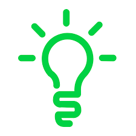

========
Overview
========

What is the project?
---------------------

Introduction
++++++++++++

The ``pilot-python`` project goal is to show an example of how to develop a Python Library.

This project is fully functional (it passes CI, has tests, etc.) and mimics a "real" python library implementing a
simple ``hello_world``.

You can use this repository as a template to
`start a new project <https://google.com>`_.

Here is a picture:

